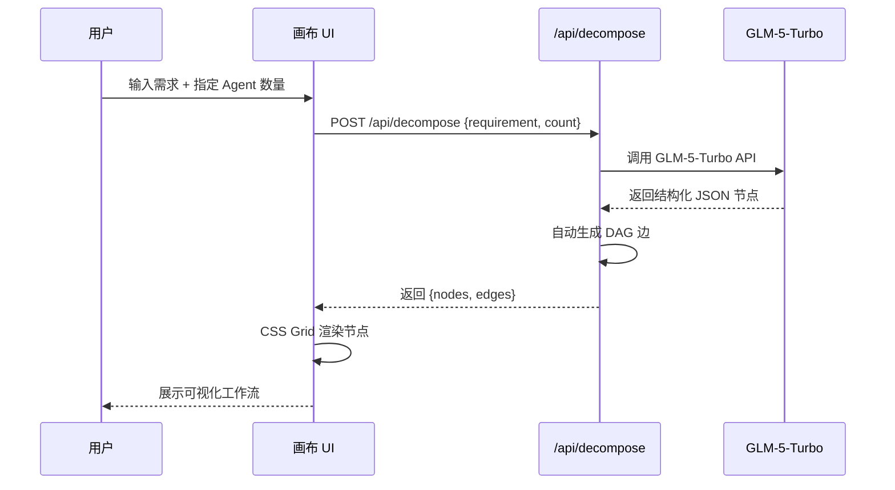
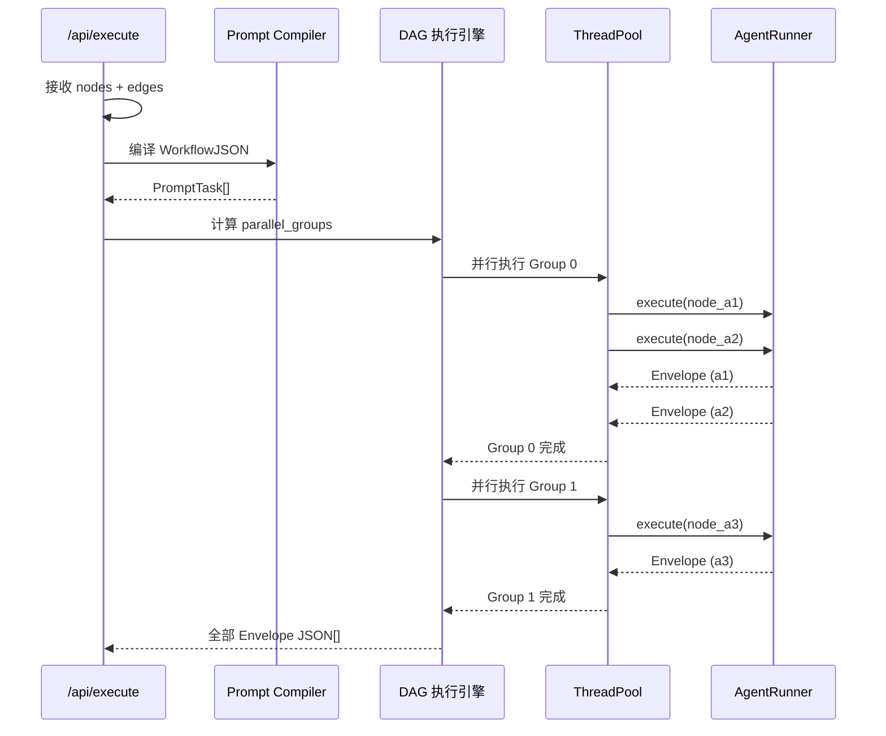
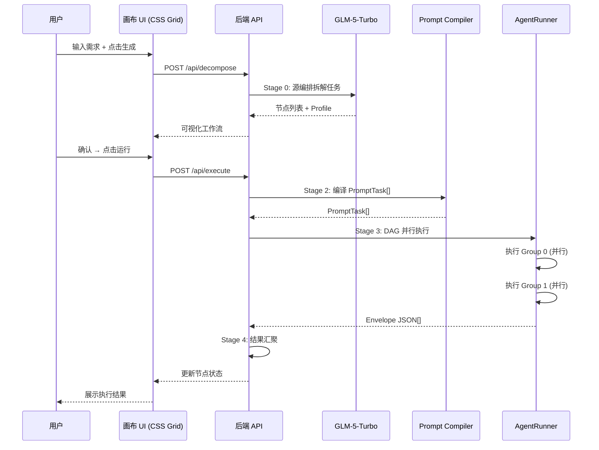

# 02.1 核心流水线：6 阶段转换链路

> 本文档详细描述 AgentFlow 从用户输入需求到结果回显的完整 6 阶段数据转换链路。

---

## 流水线总览

```
┌────────────────────────────────────────────────────────────────────────────────────────────┐
│                              AgentFlow 核心流水线                                            │
│                                                                                            │
│  Stage 0           Stage 1          Stage 2            Stage 3              Stage 4       │
│ ┌───────────┐    ┌────────────┐    ┌────────────┐    ┌────────────────┐    ┌───────────┐  │
│ │ 源编排     │──→│ 画布       │──→│ Prompt     │──→│ DAG 并行执行    │──→│ 结果汇聚   │  │
│ │ GLM-5-    │    │ CSS Grid  │    │ Compiler   │    │ AgentRunner    │    │ 画布更新  │  │
│ │ Turbo     │    │ HTML      │    │ (自研)     │    │ + ThreadPool   │    │ (自研)    │  │
│ └───────────┘    └────────────┘    └────────────┘    │ (自研)         │    └───────────┘  │
│      │                │               │              └────────────────┘         │         │
│      ▼                ▼               ▼                      ▼                  ▼         │
│ 原始节点+边     WorkflowJSON     PromptTask[]          Envelope JSON[]     画布节点状态  │
│                                                                                            │
│  ◄──────────────────── 回环：非最终节点完成后触发下游执行 ───────────────────────────────►  │
└────────────────────────────────────────────────────────────────────────────────────────────┘
```

---

## Stage 0：源编排 — 用户一句话 → WorkflowJSON（节点 + DAG）

### 功能描述

用户输入一句话需求（如"为四旋翼无人机设计PID控制器并生成C++代码，然后编译测试"），**源编排 Agent** 自动调用 GLM-5-Turbo 大模型，将需求拆解为多个子任务节点，并为每个节点分配 Agent Profile（analysis/design/dev/test/doc/deploy），同时自动生成链式 DAG 依赖关系。

这是 AgentFlow 的核心差异化能力 — 从用户一句话自动生成完整的工作流。

### 输入

- 用户需求文本（如 "为四旋翼无人机设计PID控制器并生成C++代码，然后编译测试"）
- Agent 数量（用户可指定，系统推荐默认值）

### 调用方式：POST /api/decompose

```json
{
  "requirement": "为四旋翼无人机设计PID控制器并生成C++代码，然后编译测试",
  "count": 6
}
```

### 输出：节点列表 + DAG 边

```json
{
  "nodes": [
    {
      "id": "a1", "icon": "📋", "label": "需求分析",
      "desc": "解析需求→确定控制目标", "color": "blue", "profile": "analysis"
    },
    {
      "id": "a2", "icon": "🧮", "label": "系统建模",
      "desc": "四旋翼动力学模型→传递函数", "color": "blue", "profile": "design"
    },
    {
      "id": "a3", "icon": "📐", "label": "控制器设计",
      "desc": "Ziegler-Nichols→PID参数整定", "color": "purple", "profile": "design"
    },
    {
      "id": "a4", "icon": "💻", "label": "C++代码生成",
      "desc": "ArduPilot框架→PID.cpp", "color": "green", "profile": "dev"
    },
    {
      "id": "a5", "icon": "🧪", "label": "编译测试",
      "desc": "scons cuav-v5→单元测试", "color": "purple", "profile": "test"
    },
    {
      "id": "a6", "icon": "📝", "label": "输出报告",
      "desc": "综合结果→可交付文档", "color": "orange", "profile": "doc"
    }
  ],
  "edges": [
    { "source": "a1", "target": "a2" },
    { "source": "a2", "target": "a3" },
    { "source": "a3", "target": "a4" },
    { "source": "a4", "target": "a5" },
    { "source": "a5", "target": "a6" }
  ],
  "count": 6
}
```

### 关键设计

- **GLM-5-Turbo 智能拆解** — 调用智谱 GLM-5-Turbo API，System Prompt 严格约束返回格式为 JSON 数组，每个节点包含 id、icon、label、desc、color、profile
- **Profile 自动分配** — 第一个节点固定为 analysis（需求分析），最后一个固定为 doc 或 deploy（输出交付），中间节点按剩余数量均匀分配
- **链式 DAG** — 默认生成链式串联边：analysis → design → dev → test → doc
- **本地降级模板** — 当 GLM-5-Turbo API 不可用时，自动降级为本地预置模板（涵盖 PID控制、企业网站、机器学习、自动驾驶等场景）
- **数量裁剪** — 支持用户指定 Agent 数量，系统自动裁剪或扩展节点至目标数量

### 序列图



---

## Stage 1：画布确认 — WorkflowJSON 展示与确认

### 功能描述

源编排生成的节点和边在 **CSS Grid HTML 画布**上以可视化方式展示，用户可确认工作流结构或调整。点击"执行"按钮后，前端将节点和边提交到后端。

### 输入

- 源编排返回的节点列表 + DAG 边（来自 Stage 0）

### 输出：WorkflowJSON

```json
{
  "workflow_id": "wf-20260610-001",
  "name": "四旋翼无人机PID控制器",
  "global_context": {
    "goal": "为四旋翼无人机设计PID控制器并生成C++代码，然后编译测试",
    "language": "zh-CN",
    "constraints": []
  },
  "nodes": [
    {
      "id": "a1", "icon": "📋", "label": "需求分析",
      "desc": "解析需求→确定控制目标", "color": "blue", "profile": "analysis"
    }
  ],
  "edges": [
    { "source": "a1", "target": "a2" }
  ]
}
```

### 关键设计

- **CSS Grid 布局** — 采用 CSS Grid 网格布局实现横平竖直的节点展示，`grid-template-columns: step-num | agent-card | arrow | output-card`
- **执行状态实时更新** — 每个节点通过 CSS class（pending/running/done）实时反映执行状态
- **可视化反馈** — 节点卡片颜色随 profile 变化（blue=分析, purple=设计, green=开发, orange=文档）

---

## Stage 2：WorkflowJSON → PromptTask[]

### 功能描述

**Prompt Compiler**（自研 Python 实现）将 WorkflowJSON 编译为一组可执行的 `PromptTask[]`。编译器解析工作流拓扑、加载 YAML 模板、渲染变量、生成每个 Agent 节点所需的完整自然语言提示词。

### 输入

- WorkflowJSON（来自 Stage 1）
- YAML 模板文件（`templates/{profile}.yaml`，每个 profile 一个模板）
- 用户输入的原始需求（作为 global_context.goal）

### 输出：PromptTask[]

```json
[
  {
    "task_id": "task_a1",
    "workflow_id": "wf_xxx",
    "node_id": "a1",
    "node_type": "analysis",
    "sequence": 1,
    "parallel_group": 0,
    "depends_on": [],
    "prompt": "<渲染后的完整自然语言提示词>",
    "system_prompt": "<Agent system prompt>",
    "tool_set": ["bash", "read", "write"],
    "max_turns": 10,
    "timeout_s": 120
  }
]
```

### 实现原理

```python
# prompt_compiler.py — 核心流程
compiler = PromptCompiler(template_dir="templates/")
tasks = compiler.compile(workflow_json)
# 1. Kahn 拓扑排序 → 确定执行顺序 + 并行分组
# 2. 对每个节点：加载 YAML 模板 → 渲染变量 → 组装 PromptTask
# 3. 支持变量：{global.goal}, {node.label}, {param.xxx}, {upstream_context}
```

### 关键设计

- **拓扑排序** — 使用 Kahn 算法对 DAG 节点排序，确定执行顺序和并行分组
- **模板引擎** — 加载 YAML 格式的 profile 模板，支持 `{global.goal}`、`{node.label}`、`{param.description}`、`{upstream_context}` 等占位符变量
- **上游上下文注入** — 自动收集所有上游节点的输出结果，注入到下游节点的 `{upstream_context}` 变量中
- **依赖声明** — `depends_on` 字段显式声明任务间依赖，供 Stage 3 DAG 执行引擎使用
- **6 种 Profile 模板** — analysis / design / dev / test / doc / deploy 各有一套独立 YAML 模板

---

## Stage 3：DAG 并行执行 — PromptTask[] → Envelope JSON[]

### 功能描述

**DAG 并行执行引擎**（自研，`agentflow-backend.py handle_execute`）接收 `PromptTask[]`，按拓扑深度分组，同组节点通过 `ThreadPoolExecutor` 并行执行，每组执行完毕后自动推进到下一组。

每个节点由 **AgentRunner**（自研，`agent_runner.py`）驱动，支持 12+ 个 OpenAI 兼容 API 供应商。

### 输入

- PromptTask[]（来自 Stage 2）
- 原始需求文本

### 处理流程

```
PromptTask[]
     │
     ▼
┌──────────────────┐
│ Kahn 拓扑排序     │ → 计算 parallel_groups = [[层0], [层1], ...]
└──────┬───────────┘
       │
       ▼
┌──────────────────┐
│ ThreadPoolExecutor│ → 同组节点并行执行
│ for each group    │
└──────┬───────────┘
       │
       ▼
┌──────────────────┐
│ AgentRunner       │ → 调用 LLM API（OpenAI 兼容）
│ execute(prompt)   │ → 支持 12+ 供应商
└──────┬───────────┘
       │
       ▼
  Envelope JSON[]   ← 每个节点的执行结果
```

### 输出：Envelope JSON 列表

```json
{
  "task_id": "task_a1",
  "node_id": "a1",
  "status": "ok",
  "summary": "目标:四旋翼悬停控制",
  "cost": 0.0012,
  "duration": 3200,
  "turns": 5,
  "model": "glm-5-turbo",
  "provider": "zhipu"
}
```

### 关键设计

- **DAG 分层并行** — 通过 `parallel_groups()` 函数将节点按拓扑深度分组，同组无依赖关系的节点通过 `ThreadPoolExecutor` 并行执行
- **AgentRunner 统一抽象** — 所有 LLM 调用通过 AgentRunner 统一管理，自动根据模型名选择 provider（glm-5-turbo → 智谱, deepseek-chat → DeepSeek, gpt-4o → OpenAI 等）
- **12+ Provider 支持** — 内置 DeepSeek、智谱 GLM、xAI Grok、OpenAI、阿里通义、月之暗面、SiliconFlow、零一万物、MiniMax、百度千帆、腾讯混元、阶跃星辰
- **零容器开销** — Agent 通过 Python subprocess 直接运行，无需 Docker 容器，大幅降低延迟和资源消耗
- **临时工作目录** — 每个节点在临时目录中独立执行，互不干扰

### 序列图



---

## Stage 4：结果汇聚 — Envelope JSON[] → 画布更新

### 功能描述

汇聚引擎收集所有 Agent 节点的 Envelope JSON，提取结果、计算总成本/耗时，最终将结果写回画布，更新每个节点的状态和展示内容。

### 输入

- Envelope JSON 列表（来自 Stage 3，每个节点一个）

### 处理流程

```
Envelope JSON 列表
       │
       ▼
┌──────────────────┐
│ 结果提取          │ ← 从每个 Envelope 提取 summary / cost / duration
└──────┬───────────┘
       │
       ▼
┌──────────────────┐
│ 节点状态更新      │ ← status: pending → ok/error
└──────┬───────────┘
       │
       ▼
┌──────────────────┐
│ 汇总指标          │ ← total_cost, total_duration, groups
└──────┬───────────┘
       │
       ▼
┌──────────────────┐
│ 返回给前端画布     │ ← 前端自动更新 CSS Grid 卡片状态
└──────────────────┘
```

### 输出

```json
{
  "nodes": [
    {
      "id": "a1", "result": "目标:四旋翼悬停控制",
      "status": "ok", "cost": 0.0012, "duration": 3200, "turns": 5,
      "model": "glm-5-turbo", "provider": "zhipu"
    }
  ],
  "total_cost": 0.0085,
  "total_duration": 18700,
  "groups": [2, 2, 1, 1]
}
```

### 关键设计

- **轻量校验** — 使用 `validate_workflow()` 函数进行基本完整性检查（节点引用有效性、profile 合法性），而非复杂的 JSON Schema 验证
- **结果回写** — 将每个节点的 result、status、cost、duration、turns 回写到 NodeDef，通过 `node.to_dict()` 序列化返回
- **前端状态同步** — 前端根据返回的 status 自动更新 CSS 类（`.c-agent.executing` / `.c-agent.done`），实现实时可视化反馈
- **指标统计** — 汇总总成本（美元）、总耗时（毫秒）、各层并行度，供用户了解执行效率

---

## 端到端执行序列



---

## 错误处理矩阵

| 阶段 | 可能的失败 | 处理策略 |
|------|-----------|---------|
| Stage 0 | GLM-5-Turbo API 超时/错误 | 自动降级为本地预置模板（PID控制/网站/ML等） |
| Stage 0 | LLM 返回格式异常 | 尝试解析 JSON，失败则使用 fallback_template() |
| Stage 1 | 节点/边数据无效 | 前端提示用户检查 |
| Stage 2 | YAML 模板不存在 | 自动使用 dev.yaml 作为默认模板，记录警告 |
| Stage 3 | Agent 执行异常 | 捕获异常，标记节点为 error 并继续执行其他节点 |
| Stage 3 | LLM API 返回空 | 使用默认结果"完成"，避免空指针 |
| Stage 4 | 结果汇聚失败 | 部分结果仍返回给前端，标记失败节点 |

---

## 数据契约定义

6 阶段之间通过以下核心数据契约定义边界：

| 契约 | 定义文件 | 用途 |
|------|---------|------|
| `NodeDef` / `EdgeDef` | `agentflow_schema.py` | Stage 0 → Stage 1 |
| `WorkflowJSON` | `agentflow_schema.py` | Stage 1 → Stage 2 |
| `PromptTask` | `agentflow_schema.py` | Stage 2 → Stage 3 |
| `EnvelopeJSON` | `agentflow_schema.py` | Stage 3 → Stage 4 |
| `NodeDef.to_dict()` | `agentflow_schema.py` | Stage 4 → 画布 |

所有数据契约定义在 `agentflow_schema.py` 中，使用 Python `@dataclass` 实现，支持 `from_dict()` / `to_dict()` 序列化。
