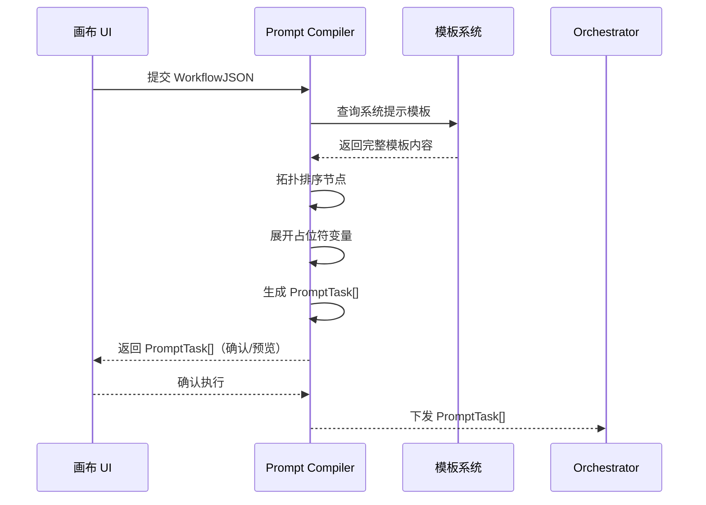
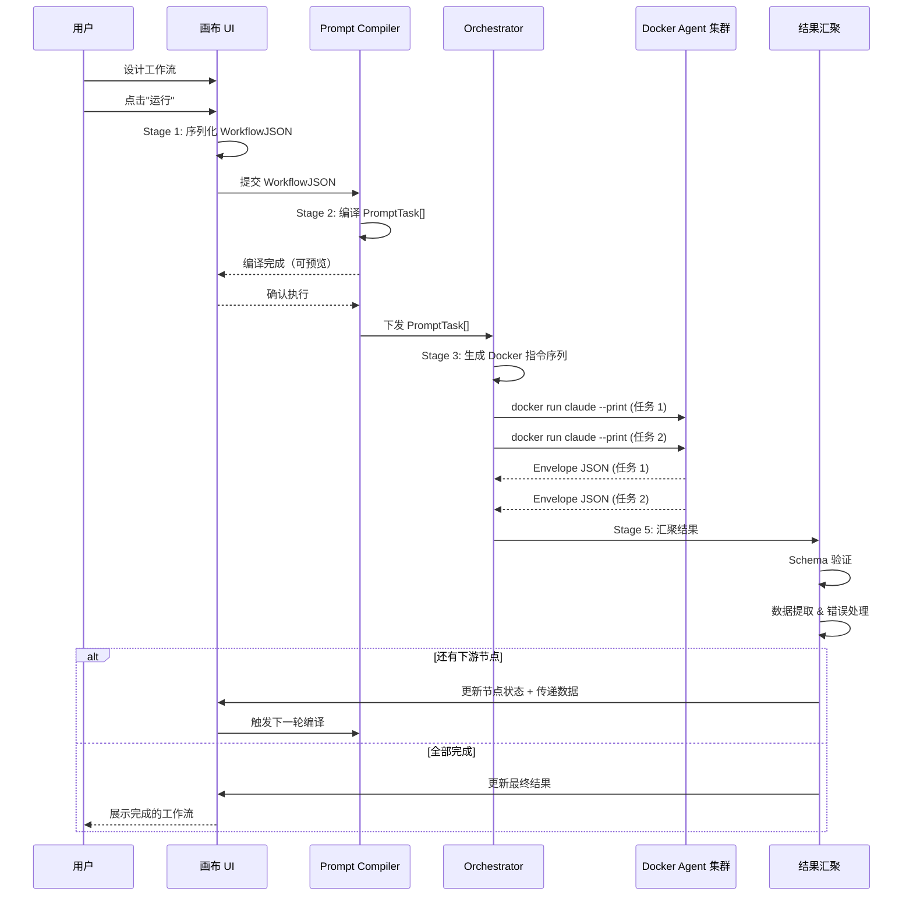

# 02.1 核心流水线：5 阶段转换链路

> 本文档详细描述 AgentFlow 从画布设计到结果回显的完整 5 阶段数据转换链路。

---

## 流水线总览

```
┌─────────────────────────────────────────────────────────────────────────────┐
│                          AgentFlow 核心流水线                                │
│                                                                             │
│  Stage 1          Stage 2            Stage 3           Stage 4          Stage 5  │
│ ┌────────┐    ┌─────────────┐    ┌────────────┐    ┌──────────┐    ┌──────────┐  │
│ │ 画布    │──→│ Prompt      │──→│ Orchestrator│──→│ Agent    │──→│ 结果     │  │
│ │ UI     │    │ Compiler    │    │            │    │ 集群     │    │ 汇聚     │  │
│ │React   │    │ (Claude Code)│   │ (Hermes    │    │(Docker   │    │(Schema   │  │
│ │ Flow   │    │             │    │  Agent)    │    │ + Claude │    │ 验证)    │  │
│ └────────┘    └─────────────┘    └────────────┘    │  Code)   │    └──────────┘  │
│      │               │                │            └──────────┘         │      │
│      ▼               ▼                ▼                ▼                ▼      │
│ WorkflowJSON   PromptTask[]    docker run指令     Envelope JSON    画布更新      │
│                                                                             │
│  ◄────────────────────────── 回环：结果驱动下一节点 ─────────────────────────►  │
└─────────────────────────────────────────────────────────────────────────────┘
```

---

## Stage 1：画布 → WorkflowJSON

### 功能描述

将用户在 React Flow 画布上拖拽编排的图形化工作流（节点 + 边）序列化为结构化的 `WorkflowJSON` 格式，作为下游编译器的输入。

### 输入

- React Flow 节点列表（`nodes[]`）：包含每个节点的类型、位置、配置参数
- React Flow 边列表（`edges[]`）：包含节点间的连接关系、数据流向

### 输出：WorkflowJSON

```json
{
  "workflow_id": "wf-20260609-001",
  "version": "1.0",
  "nodes": [
    {
      "id": "node-001",
      "type": "agent_llm",
      "label": "代码审查 Agent",
      "config": {
        "model": "claude-sonnet-4",
        "system_prompt_ref": "tpl://code-review",
        "temperature": 0.3,
        "max_tokens": 8192
      },
      "position": { "x": 100, "y": 200 }
    },
    {
      "id": "node-002",
      "type": "tool_file_operation",
      "label": "文件读取",
      "config": {
        "path": "{{input.file_path}}",
        "mode": "read"
      }
    }
  ],
  "edges": [
    {
      "id": "edge-001",
      "source": "node-001",
      "target": "node-002",
      "data_map": { "output": "input" }
    }
  ],
  "metadata": {
    "author": "user",
    "created_at": "2026-06-09T10:00:00Z",
    "canvas_zoom": 1.0
  }
}
```

### 关键设计

- **节点类型注册表** — 所有可用节点类型（Agent 节点、工具节点、条件节点等）在 L0 源编排层注册，React Flow 通过注册表渲染对应的节点 UI
- **配置模板引用** — 节点配置中的 `system_prompt_ref` 引用 L1 模板系统中的预定义模板，支持占位符变量（`{{...}}`）
- **数据映射** — `edges[].data_map` 定义了上游节点输出字段到下游节点输入字段的映射关系

---

## Stage 2：WorkflowJSON → PromptTask[]

### 功能描述

Prompt Compiler Agent（基于 Claude Code 构建）将 WorkflowJSON 编译为一组可执行的 `PromptTask[]`。编译器解析工作流拓扑、展开模板变量、生成每个 Agent 节点所需的完整 Prompt 上下文。

### 输入

- WorkflowJSON（来自 Stage 1）
- 模板系统（L1）：包含 `system_prompt_ref` 对应的完整 Prompt 模板
- 变量上下文：当前工作流运行时的输入参数

### 输出：PromptTask[]

```json
[
  {
    "task_id": "task-001",
    "node_id": "node-001",
    "type": "agent_llm",
    "prompt": {
      "system": "你是一名资深的代码审查专家...\n\n## 上下文\n项目路径: /repo/my-project\n审查范围: src/**/*.ts\n\n## 规则\n1. 检查 TypeScript 类型安全\n2. 检查性能瓶颈\n3. 检查代码风格一致性",
      "user": "请对以下 PR 变更进行代码审查：\n{{input.diff_content}}",
      "model": "claude-sonnet-4",
      "temperature": 0.3,
      "max_tokens": 8192
    },
    "tool_config": {
      "allowed_tools": ["read_file", "grep_search", "list_files"],
      "workspace": "/workspace/my-project"
    },
    "depends_on": ["task-002"],
    "output_schema": {
      "$ref": "schema://review-result"
    }
  }
]
```

### 关键设计

- **拓扑排序** — Compiler 根据 edges 的依赖关系对节点进行拓扑排序，生成正确的执行序列表
- **模板编译** — 递归展开 `{{...}}` 占位符，支持链式变量引用（如 `{{node-002.output.files}}`）
- **依赖注入** — `depends_on` 字段显式声明任务间依赖，供 Orchestrator 调度使用
- **输出 Schema** — 每个任务声明期望的输出 Schema，用于 Stage 5 的验证

### 序列图



---

## Stage 3：PromptTask[] → docker run 指令

### 功能描述

Orchestrator（基于 Hermes Agent 构建）接收 `PromptTask[]`，根据依赖关系、资源约束、并行策略，生成具体的 Docker 运行指令序列。

### 输入

- PromptTask[]（来自 Stage 2）
- 集群资源配置（可用容器数、GPU 分配等）

### 输出：Docker 指令序列

```json
[
  {
    "step": 1,
    "action": "docker_run",
    "image": "claude-code:latest",
    "container_name": "agentflow-task-001",
    "volumes": [
      { "host": "/home/user/projects/my-repo", "container": "/workspace" }
    ],
    "env": {
      "ANTHROPIC_API_KEY": "sk-...",
      "AGENTFLOW_TASK_ID": "task-001",
      "PROMPT_FILE": "/tmp/prompt-task-001.json"
    },
    "command": [
      "claude",
      "--print",
      "--prompt-file", "/tmp/prompt-task-001.json",
      "--output-file", "/tmp/envelope-001.json"
    ],
    "resources": { "cpus": 2, "memory": "4G" },
    "depends_on": ["task-002"]
  }
]
```

### 关键设计

- **并行调度** — 无依赖关系的任务可以并行启动（通过 `depends_on` 判定）
- **资源管理** — 支持设置 CPU/Memory 限制，避免 Agent 容器争抢资源
- **超时控制** — 每个容器有最大执行时间，超时自动 kill 并标记失败
- **重试策略** — 可配置失败重试次数与退避策略

---

## Stage 4：docker run claude --print → Envelope JSON

### 功能描述

每个 Agent 节点在独立的 Docker 容器中启动 Claude Code CLI（`claude --print` 模式），接收 Compiler 生成的 Prompt，执行 LLM 调用和工具操作，输出结构化的 `Envelope JSON`。

### 输入

- Docker 容器启动指令（来自 Stage 3）
- 挂载的工作目录（包含源代码、数据文件等）
- 环境变量（API Key、配置等）

### 输出：Envelope JSON

```json
{
  "envelope_version": "1.0",
  "task_id": "task-001",
  "status": "success",
  "output": {
    "review_summary": "发现 3 个关键问题...",
    "issues": [
      {
        "file": "src/core/processor.ts",
        "line": 142,
        "severity": "high",
        "message": "潜在的竞态条件：共享状态未加锁"
      }
    ],
    "score": 72
  },
  "artifacts": [
    {
      "path": "/tmp/fix-suggestion.diff",
      "type": "patch_file"
    }
  ],
  "metrics": {
    "tokens_used": 15234,
    "api_calls": 12,
    "wall_time_ms": 45200,
    "tool_calls": 8
  },
  "errors": []
}
```

### 关键设计

- **`--print` 模式** — Claude Code 以非交互式方式运行，只执行一次 LLM 调用 + 工具调用循环后输出结果，适用于工作流节点
- **Envelope 标准** — 所有 Agent 节点输出统一格式的 Envelope JSON，包含状态、输出数据、产物、指标和错误信息
- **产物收集** — Agent 可以输出中间产物（代码 diff、生成的配置文件等），通过 `artifacts` 字段传递
- **指标上报** — `metrics` 字段记录执行耗时、Token 消耗等，供 L6 运维层监控

---

## Stage 5：Envelope JSON → 验证 → 画布更新 / 下一节点

### 功能描述

汇聚引擎接收所有 Agent 节点的 Envelope JSON，进行 Schema 验证、数据提取、错误处理，最终将结果写回画布（更新当前节点状态）或驱动下一节点（传递数据到下游）。

### 输入

- Envelope JSON 列表（来自 Stage 4，每个节点一个）

### 处理流程

```
Envelope JSON 列表
       │
       ▼
┌──────────────────┐
│  Schema 验证      │ ← 对比 PromptTask[].output_schema
│  (JSON Schema)    │
└──────┬───────────┘
       │ 通过
       ▼
┌──────────────────┐
│ 数据提取 & 转换    │ ← 按 output_schema 提取/转换输出字段
└──────┬───────────┘
       │
       ▼
┌──────────────────┐
│ 错误处理          │ ← 部分失败策略（整体失败 / 降级 / 忽略）
└──────┬───────────┘
       │
       ▼
┌──────────────────┐
│ 画布更新 / 下一节点 │ ← 写入节点结果 / 传递数据到下游
└──────────────────┘
```

### 关键设计

- **Schema 验证** — 使用 JSON Schema 对每个节点的 Envelope output 进行校验，确保输出格式与预期一致
- **部分失败策略** — 支持三种策略：
  - `fail_fast` — 任一节点失败则整体工作流终止
  - `graceful_degrade` — 失败节点输出默认值，后续节点继续执行
  - `ignore` — 忽略失败，流程继续
- **画布反向同步** — 更新 React Flow 节点状态（success/failed/running），用户可在画布上实时看到执行进度
- **数据传递** — 将当前节点输出按 edge 的 `data_map` 映射后传递到下游节点，触发下一个执行轮次

---

## 端到端执行序列



---

## 错误处理矩阵

| 阶段 | 可能的失败 | 处理策略 |
|------|-----------|---------|
| Stage 1 | WorkflowJSON 序列化失败 | 提示用户检查画布节点配置 |
| Stage 2 | 模板未找到 / 变量未定义 | 编译时报错，高亮具体问题节点 |
| Stage 3 | 资源不足无法调度 | 排队等待或提示用户释放资源 |
| Stage 4 | Agent 容器超时 / API 错误 | 按步骤失败策略处理，记录错误详情 |
| Stage 5 | Schema 验证失败 | 尝试智能修复，否则标记节点为 failed |

---

## Schema 契约定义

5 阶段之间通过以下核心 Schema（JSON Schema）定义契约边界：

| Schema | 定义 | 用途 |
|--------|------|------|
| `WorkflowJSON` | L0 源编排层定义 | Stage 1 → Stage 2 |
| `PromptTask` | L1 编译器定义 | Stage 2 → Stage 3 |
| `DockerRunSpec` | L1 编排器定义 | Stage 3 → Stage 4 |
| `Envelope` | L1 核心引擎定义 | Stage 4 → Stage 5 |
| `NodeResult` | L0 源编排层定义 | Stage 5 → 画布 |

所有 Schema 的版本管理跟随 `package.json` 的 `major.minor` 版本号，保证向后兼容。
