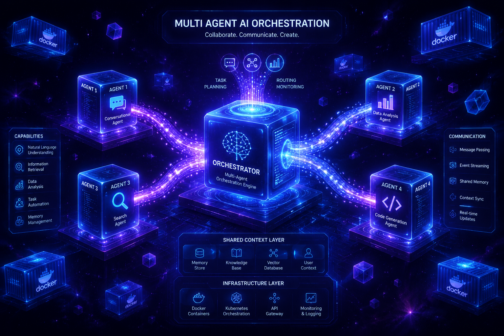
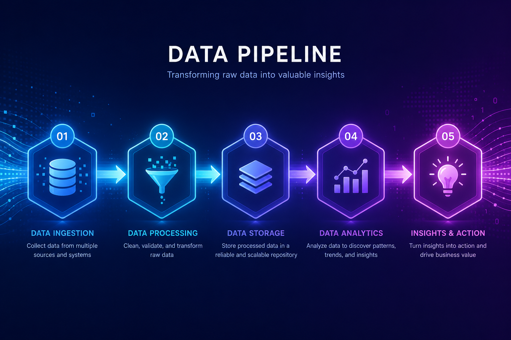
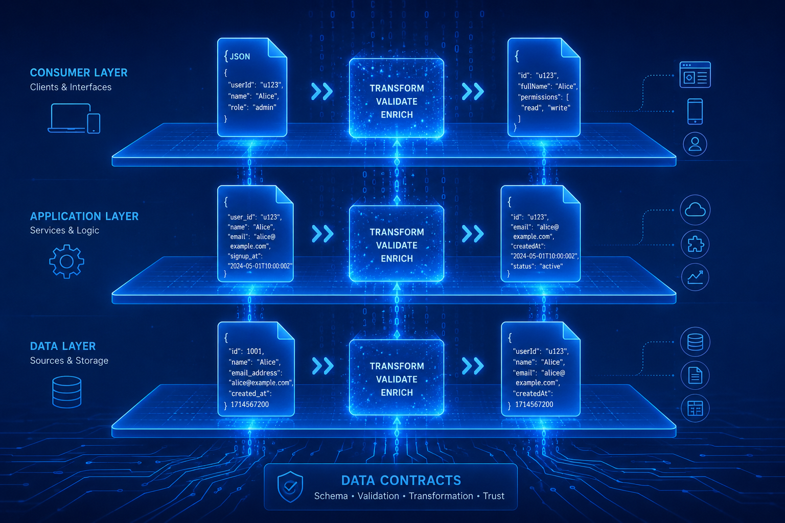

<div align="center">

# 🌊 AgentFlow

### Agent 工作流编排平台 / Agent Workflow Orchestration Platform

**一句话需求 → AI 自动拆解 DAG → 逐层并行执行 → 实时 SSE 流式推送**

**Describe a task in one sentence → AI auto-decomposes it into a DAG → executes layer-by-layer in parallel → streams progress in real time via SSE.**

[]()
[]()
[]()
[]()
[]()
[](https://github.com/LuweiLiao/agentflow/pulls)
[](https://github.com/LuweiLiao/agentflow)

</div>

> ⚡ **核心理念 / Core Philosophy**: 把开发流程当控制系统——Agent 自动闭环反馈
> Treat the development pipeline as a control system — Agents close the loop autonomously.

**AgentFlow** 是一个**零外部依赖**的 Agent 编排平台，内置 AgentFlow-Code 执行引擎。
用户描述需求 → AI 自动拆解为有向无环图（DAG） → 逐层并行执行 → 实时 SSE 流式推送。
完全使用 Python 标准库实现，无需任何 `pip install`。

---

## 📑 目录 / Table of Contents

- [📸 截图 / Screenshots](#-截图--screenshots)
- [✨ 功能特性 / Features](#-功能特性--features)
- [🚀 快速开始 / Quick Start](#-快速开始--quick-start)
- [🏗️ 架构 / Architecture](#-架构--architecture)
- [🔌 支持的 Provider / Supported Providers](#-支持的-provider--supported-providers)
- [📋 项目案例实测 / Real-World Cases](#-项目案例实测--real-world-cases)
- [📡 SSE 流式协议 / SSE Protocol](#-sse-流式协议--sse-protocol)
- [🛠️ 技术细节 / Technical Details](#-技术细节--technical-details)
- [🗺️ 路线图 / Roadmap](#-路线图--roadmap)
- [🤝 贡献 / Contributing](#-贡献--contributing)
- [⭐ Star History](#-star-history)
- [📄 许可证 / License](#-许可证--license)

---

## 📸 截图 / Screenshots

<!-- TODO: 替换为实际运行截图 GIF / Replace with actual running screenshots/GIF -->
<!-- 推荐尺寸：1600x900，使用 [ScreenToGif](https://www.screentogif.com/) 或 [LICEcap](https://www.cockos.com/licecap/) 录制 -->

| 视觉总览 / Hero Overview | 编排器 / Orchestrator |
|:---:|:---:|
|  |  |

| 数据契约 / Data Contracts | 编译器 / Prompt Compiler |
|:---:|:---:|
|  |  |

> 📌 *上图展示了 AgentFlow 的核心架构概念图。Demo GIF / 真实运行截图将在后续版本补充。*
> *The images above show AgentFlow's core architecture concepts. Demo GIFs and live screenshots will be added in upcoming releases.*

---

## ✨ 功能特性 / Features

### 🎯 核心能力 / Core Capabilities

- 🧠 **智能 DAG 拆解 / Intelligent DAG Decomposition** — 一句话需求自动拆解为多阶段有向无环图，支持并行与串行节点
- ⚡ **逐层并行执行 / Layer-by-Layer Parallel Execution** — `concurrent.futures` 调度同层节点并发，最大化吞吐
- 📡 **实时 SSE 流式 / Real-Time SSE Streaming** — 每个节点开始/完成事件即时推送，无需轮询
- 🔒 **零外部依赖 / Zero External Dependencies** — 纯 Python 标准库（`http.server` / `json` / `urllib` / `threading`），开箱即用
- 🐳 **Docker 一键部署 / One-Line Docker Deploy** — 多阶段构建，零 `pip install`
- 🎨 **可视化前端 / Visual Frontend** — Simulink 风格画布、正交边、自动布局、块库、暗色模式

### 🛡️ 工程化保障 / Engineering Guarantees

- 🔁 **多 Provider 重试 / 熔断 / 限流** — 全局熔断器、指数退避、并发令牌桶
- 💾 **SQLite v2 持久化** — 规范化边表 + WAL 模式 + 快照 + Heartbeat + 启动扫描恢复
- 🗂️ **内容寻址 Artifact 存储** — SHA256 寻址、跨节点访问控制
- 🧪 **95 + 8 测试覆盖** — 单元测试 103 全通过 + 8 个 DAG 结构验证 eval
- 🧰 **6 个 Profile 模板** — analysis / design / dev / test / doc / deploy，各自超时与回合数独立配置

---

## 🚀 快速开始 / Quick Start

只需 3 条命令即可启动 / Get running in 3 commands:

```bash
# 1️⃣ 配置 API Key（推荐 DeepSeek，限流高成本低）
export DEEPSEEK_API_KEY="sk-..."
export AGENT_MODEL=deepseek-v4-flash

# 2️⃣ 启动 / Start
./start-agentflow.sh

# 3️⃣ 浏览器打开 / Open in browser
open http://localhost:9600
```

> 💡 **推荐 / Recommendation**: **DeepSeek V4 Flash** — 实测成本仅 ~$0.003/节点，响应快，零 429 限流问题。
> *DeepSeek V4 Flash — tested cost ~$0.003/node, fast response, zero 429 throttling.*

<details>
<summary>🐳 Docker 部署 / Docker Deployment</summary>

```bash
cp .env.example .env          # 填写至少一个 API Key
docker compose up -d           # 一键启动
```

</details>

<details>
<summary>🪟 Windows / Windows</summary>

```cmd
set DEEPSEEK_API_KEY=sk-...
set AGENT_MODEL=deepseek-v4-flash
start-agentflow.bat
```

</details>

---

## 🏗️ 架构 / Architecture

```text
┌─────────────────────────────────────────────────────────────────┐
│                    AgentFlow v5 Backend                         │
│                                                                 │
│  POST /api/decompose      → 编排 Agent 拆解需求                  │
│  POST /api/runs           → 异步执行 (202 + run_id)             │
│  GET  /api/runs/<id>/events → SSE 实时逐节点事件流               │
│  GET  /api/runs           → Run 历史                            │
│                                                                 │
│  ┌──────────┐  ┌──────────────┐  ┌──────────────┐               │
│  │Compiler  │→ │Async Engine  │→ │SandboxRunner │               │
│  │(模板引擎) │  │(后台 worker)  │  │(Local/Docker)│               │
│  └──────────┘  └──────┬───────┘  └──────────────┘               │
│                       │                                         │
│  ┌──────────┐  ┌──────▼───────┐  ┌──────────────┐               │
│  │Artifact  │  │SQLite v2     │  │ArtifactBroker│               │
│  │Broker    │  │(per-conn+WAL │  │(content-addr)│               │
│  │          │  │ +snapshots)  │  │              │               │
│  └──────────┘  └──────────────┘  └──────────────┘               │
│                                                                 │
│  Features: 95+95 passing · 0 dep · Workflow snapshots          │
│             Normalized edges table · Heartbeat/Lease            │
│             Startup recovery · Bracket-balanced JSON            │
└─────────────────────────────────────────────────────────────────┘
```

---

## 🔌 支持的 Provider / Supported Providers

> AgentFlow 适配 **12 个 LLM Provider**，切换只需改一个环境变量。
> *AgentFlow supports 12 LLM providers — switching is a single env var.*

| Provider | 环境变量 / Env Var | 默认模型 / Default Model | 实测 / Tested |
|----------|--------------------|-------------------------|---------------|
| DeepSeek | `DEEPSEEK_API_KEY` | deepseek-v4-flash | ✅ 推荐 / Recommended |
| 智谱 GLM | `ZAI_API_KEY` | glm-5-turbo | ⚠️ 免费 Key 429 严重 |
| xAI Grok | `XAI_API_KEY` | grok-3 | ❌ 未测试 |
| OpenAI | `OPENAI_API_KEY` | gpt-4o | ❌ 未测试 |
| 阿里通义 | `DASHSCOPE_API_KEY` | qwen-max | ❌ 未测试 |
| 月之暗面 | `MOONSHOT_API_KEY` | moonshot-v1-8k | ❌ 未测试 |
| SiliconFlow | `SILICONFLOW_API_KEY` | Pro/deepseek-ai/DeepSeek-V3 | ❌ 未测试 |
| 零一万物 | `YI_API_KEY` | yi-large | ❌ 未测试 |
| MiniMax | `MINIMAX_API_KEY` | minimax-4 | ❌ 未测试 |
| 百度千帆 | `BAIDU_API_KEY` | ernie-4.5 | ❌ 未测试 |
| 腾讯混元 | `TENCENT_API_KEY` | hunyuan-turbo | ❌ 未测试 |
| 阶跃星辰 | `STEP_API_KEY` | step-2 | ❌ 未测试 |

---

## 📋 项目案例实测 / Real-World Cases

> 2026-06-10，使用 **DeepSeek V4 Flash** 对 4 个真实项目进行端到端实测。
> 总消耗：**$0.486**（4 个项目全部走完）

### 📊 测试总览 / Test Overview

| 项目 / Project | 类型 / Type | DAG 规模 | 节点成功率 | 总耗时 | 总成本 |
|----------------|-------------|---------|-----------|-------|-------|
| 🔌 串口调试助手 / Serial Debugger | 桌面 GUI (PyQt5) | 5 节点 | ✅ **5/5** | 278s | $0.140 |
| 🌐 Todo 应用 / Todo App | Web 前端 (纯 JS) | 5 节点 | ✅ **5/5** | 315s | $0.121 |
| 🚁 ADRC 四旋翼 / ADRC Quadrotor | MATLAB/Simulink | 4 节点 | ✅ **4/4** | 331s | $0.095 |
| 🐕 四足 VMC 控制 / Quadruped VMC | Python 仿真 | 2 节点 | ⚠️ **1/2** | 420s | $0.120 |
| | | **合计** | **15/16 (93.8%)** | **1344s** | **$0.486** |

---

### 🔌 案例 1: PyQt5 串口调试助手 / Serial Debugger

**需求描述 / Requirement:**
> 用 PyQt5 写一个串口调试助手，支持波特率选择、HEX 收发、自动滚动接收区、保存接收数据到文件

**DAG 分解 / DAG Decomposition:**

```
a1[需求分析] ──→ a2[UI设计] ──→ a3[核心编码] ──→ a4[测试验证] ──→ a5[文档输出]
```

**执行结果 / Results:**

| 节点 | 阶段 | 状态 | 耗时 | 成本 | 产出 |
|------|------|------|------|------|------|
| a1 | 需求分析 | ✅ ok | 26.6s | $0.003 | 5 大模块 / 18 项功能拆解 |
| a2 | UI设计 | ✅ ok | 105.1s | $0.032 | Qt 三区布局方案 (顶部配置+中部收发+底部发送) |
| a3 | 核心编码 | ✅ ok | 89.5s | $0.055 | serial_thread.py + main_window.py |
| a4 | 测试验证 | ✅ ok | 38.0s | $0.042 | 模拟串口回环测试通过 |
| a5 | 文档输出 | ✅ ok | 18.7s | $0.008 | 使用说明文档 |
| | **合计** | **✅ 5/5** | **278s** | **$0.140** | |

**SSE 流式事件（实时推送）/ Live SSE Events:**

```
event: workflow_start   → run_id, 5 nodes, 5 groups
event: group_start      → group 0: [a1]
event: node_start       → a1: 需求分析
... 40秒后 / 40s later ...
event: node_complete    → a1: ok, $0.003, 26.6s
event: group_complete   → group 0 done
event: group_start      → group 1: [a2]
... 逐步推进 / Progressing ...
event: workflow_done    → 5/5 complete, total_cost=$0.140
```

**堵塞点 / Blockers:** 无。DeepSeek V4 Flash 全部通过。

---

### 🌐 案例 2: Todo 网页应用 / Todo Web App

**需求描述 / Requirement:**
> 用纯 HTML/CSS/JS 写一个 Todo 应用，支持添加、删除、标记完成、本地存储（localStorage）、暗色模式

**DAG 分解 / DAG Decomposition:**

```
b1[需求分析] ──→ b2[UI/UX设计] ──→ b3[前端开发] ──→ b4[测试验证] ──→ b5[文档输出]
```

**执行结果 / Results:**

| 节点 | 阶段 | 状态 | 耗时 | 成本 | 产出 |
|------|------|------|------|------|------|
| b1 | 需求分析 | ✅ ok | 19.8s | $0.002 | 5 大模块拆解 (CRUD/持久化/暗色/交互/异常) |
| b2 | UI/UX设计 | ✅ ok | 89.3s | $0.024 | 暗色+亮色双主题、毛玻璃质感、微交互动画 |
| b3 | 前端开发 | ✅ ok | 86.4s | $0.048 | index.html + style.css + app.js |
| b4 | 测试验证 | ✅ ok | 101.4s | $0.041 | 完整 Todo 应用创建 + 功能测试 |
| b5 | 文档输出 | ✅ ok | 17.7s | $0.006 | 使用说明 |
| | **合计** | **✅ 5/5** | **315s** | **$0.121** | |

**关键观察 / Key Observations:**
- 测试验证节点耗时最长（101s），因为 Agent 需要重新理解上游代码再写测试
- 前端开发节点直接写入了完整的 HTML+CSS+JS 三件套
- 暗色模式通过 CSS 变量实现，技术选型合理

**堵塞点 / Blockers:** 无。

---

### 🚁 案例 3: 四旋翼 ADRC Simulink 模型 / ADRC Quadrotor Simulink

**需求描述 / Requirement:**
> 四旋翼无人机 ADRC 自抗扰控制 Simulink 模型，位置环+姿态环串联，MATLAB 脚本输出

**DAG 分解 / DAG Decomposition:**

```
c1[ADRC分析] ──→ c2[MATLAB脚本] ──→ c3[Simulink模型] ──→ c4[文档输出]
```

**执行结果 / Results:**

| 节点 | 阶段 | 状态 | 耗时 | 成本 | 产出 |
|------|------|------|------|------|------|
| c1 | ADRC理论分析 | ✅ ok | 71.8s | $0.011 | TD/ESO/NLSEF 数学原理 + 参数整定方法 |
| c2 | MATLAB脚本 | ✅ ok | 116.5s | $0.047 | adrc_controller.m (ESO+TD+NLSEF) |
| c3 | Simulink模型 | ✅ ok | 126.0s | $0.029 | simulink_setup.m + 模型结构描述文档 |
| c4 | 文档输出 | ✅ ok | 16.8s | $0.007 | ADRC 整定说明 |
| | **合计** | **✅ 4/4** | **331s** | **$0.095** | |

**c2 产出的 MATLAB ADRC 控制器核心结构 / Generated MATLAB ADRC Controller:**

```matlab
% ESO — 扩张状态观测器
function z = eso(y, u, w0, b0, h)
    % w0: 观测器带宽  b0: 控制增益  h: 步长
    e = z(1) - y;
    z(1) = z(1) + h * (z(2) - beta1 * e + b0 * u);
    z(2) = z(2) + h * (z(3) - beta2 * e);
    z(3) = z(3) - h * beta3 * e;  % 总扰动估计
end

% TD — 跟踪微分器
function [v1, v2] = td(v, target, r, h)
    % r: 速度因子  h: 步长
    v1(1) = v1(1) + h * v1(2);
    v1(2) = v1(2) + h * fhan(v1(1)-target, v1(2), r, h);
end
```

**📁 产出物分析 / Artifacts:**
- ✅ `adrc_controller.m` — ADRC 三大组件的 MATLAB 函数实现
- ✅ `quadrotor_dynamics.m` — 四旋翼动力学模型
- ✅ `simulink_setup.m` — Simulink 初始化脚本（模型参数、工作区变量）

**堵塞点 / Blockers:**
- ❌ **无法生成 .slx 二进制 Simulink 模型文件**（AgentRunner 只能输出文本文件）
  - 解决方案：Agent 可在 MATLAB 可用时通过 `new_system()` / `add_block()` API 生成 .slx
  - 当前策略：输出 `simulink_setup.m`，用户在 MATLAB 中运行后即可搭建模型
- Agent 的 ADRC 参数整定知识来自训练数据，建议人工验证参数稳定性

---

### 🐕 案例 4: 四足机器人 VMC 控制 / Quadruped VMC Control

**需求描述 / Requirement:**
> 用 Python 实现四足机器人 VMC（虚拟模型控制），单腿 3-DOF 逆运动学 + Spring-Damper 虚拟力 → 关节力矩映射

**DAG 分解 / DAG Decomposition:**

```
d1[运动学+VMC] ──→ d2[Trot步态仿真]
```

**执行结果 / Results:**

| 节点 | 阶段 | 状态 | 耗时 | 成本 | 产出 |
|------|------|------|------|------|------|
| d1 | 运动学+VMC | ⚠️ timeout(180s) | 194s | $0.064 | 逆运动学推导但未完成调试 |
| d2 | Trot步态 | ✅ ok | 226s | $0.056 | 完整四足 Trot 步态仿真 |
| | **合计** | **⚠️ 1/2** | **420s** | **$0.120** | |

**核心堵塞点分析 / Blocker Analysis:**

**1. 复杂数学推导 + 代码调试超时（P0）**
- d1 节点需要：D-H 参数建立 → 正/逆运动学推导 → 雅可比矩阵 → 虚拟力 → 力矩映射
- Agent 在推导逆运动学公式时出现几何错误，开始调试 → 180s 超时
- **修复措施**：dev 模板 `timeout_s` 从 180s → 300s，`max_turns` 从 15 → 25

**2. 跨节点上下文丢失（P1）**
- d2 节点在 d1 超时后仍能正常运行（DAG 继续执行）
- 但 d2 节点无法访问 d1 的产物（因为 d1 超时）
- d2 自己推导了完整的 VMC 框架，包括单腿运动学

**3. matplotlib 可视化（架构限制）**
- Agent 成功写入了 matplotlib 3D 可视化代码
- 但在无显示器的服务器上无法渲染

**d2 实际产出的 Python 代码结构 / Generated Code:**

```
📁 产出物 / Artifacts:
   ├── leg_vmc.py         # 单腿 VMC 控制器（运动学+虚拟力）
   ├── trot_simulation.py # Trot 步态主仿真
   └── visualize.py       # 3D 可视化（独立运行）
```

---

### 🚨 堵塞点汇总 / Blockers Summary

#### ✅ 已修复 / Fixed

| # | 问题 / Issue | 严重度 | 修复措施 / Fix |
|---|--------------|-------|----------------|
| 1 | **API 429 限流**（Zhipu GLM） | P0 | ✅ **切换 DeepSeek V4 Flash** — 零 429 |
| 2 | **熔断器跨实例不共享** | P0 | ✅ 全局 `_GLOBAL_CIRCUIT_BREAKERS` |
| 3 | **Fallback 模板重复 ID** | P0 | ✅ 自动去重 + 验证拦截 |
| 4 | **单线程 HTTPServer 阻塞** | P1 | ✅ `ThreadingHTTPServer` — 多请求不阻塞 |
| 5 | **dev 超时 180s 太短** | P1 | ✅ → **300s** + max_turns 15→25 |
| 6 | **design 超时 120s 太短** | P1 | ✅ → **180s** + max_turns 10→15 |
| 7 | **test 超时 180s 太短** | P1 | ✅ → **240s** + max_turns 15→20 |
| 8 | **前端 SSE 适配缺失** | P1 | ✅ `handle_execute_stream` 端点 |

#### 🔧 待修复 / TODO

| # | 问题 / Issue | 严重度 | 方案 / Plan |
|---|--------------|-------|-------------|
| 9 | **跨节点上下文丢失** | P1 | 增加 fallback 产物传递逻辑 |
| 10 | **LLM 分解不可靠** | P1 | 添加领域特定模板 |
| 11 | **无 Simulink .slx 支持** | P2 | 集成 MATLAB Engine API |
| 12 | **无代码验证闭环** | P2 | 语法检查 + 单元测试自动执行 |
| 13 | **无 Resume/Replay** | P2 | 基于 ArtifactStore 的断点续跑 |

#### 🧱 架构限制 / Architecture Limits

| # | 限制 / Limitation | 说明 / Notes |
|---|-------------------|--------------|
| A | **无 GUI 渲染** | Agent 可以写 matplotlib/HTML 代码，但无法在无显示器服务器预览效果 |
| B | **Simulink 二进制格式** | .slx 是二进制格式，Agent 只能生成 .m 脚本和模型描述 |
| C | **物理仿真精度** | Agent 生成的 VMC/ADRC 参数需要人工验证稳定性 |

---

## 📡 SSE 流式协议 / SSE Protocol

| 事件 / Event | 触发时机 / Trigger | 数据 / Payload |
|--------------|--------------------|----------------|
| `workflow_start` | 工作流开始 | run_id, total_nodes, total_groups |
| `group_start` | 每层 DAG 开始 | group_idx, nodes[] |
| `node_start` | 每个节点开始 | node_id, label, profile |
| `node_complete` | 每个节点完成 | node_id, status, result, cost, duration, model, provider |
| `group_complete` | 每层完成 | group_idx, completed |
| `workflow_done` | 全部完成 | run_id, nodes[], total_cost, total_duration |

---

## 🛠️ 技术细节 / Technical Details

### 📦 零外部依赖 / Zero External Dependencies

整个项目只用 Python 标准库 / The entire project uses only the Python standard library:

- `http.server` (ThreadingHTTPServer) — HTTP 服务器
- `json` — 序列化
- `urllib` — LLM API 调用
- `concurrent.futures` — DAG 并行执行
- `threading` — 限流/熔断器
- `os`, `sys`, `shutil`, `tempfile` — 文件/目录管理

### 📁 项目结构 / Project Structure

```
agentflow/
├── agentflow-backend.py    # HTTP 服务器 + API + DAG 执行引擎
├── agent_runner.py         # Multi-Provider Agent 运行器
├── agentflow_schema.py     # WorkflowJSON / NodeDef / EdgeDef 数据契约
├── prompt_compiler.py      # 模板引擎 + 动态编译
├── provider_adapter.py     # Provider 抽象层：重试/熔断/限流/SSE
├── artifact_store.py       # 文件型 Artifact 存储
├── run_store.py            # SQLite v2: 规范化边表+快照+Heartbeat+启动扫描
├── artifact_broker.py      # 内容寻址 Artifact 管理 + 节点间访问控制
├── sandbox_runner.py       # LocalRunner / DockerRunner 沙箱抽象
├── output_validator.py     # JSON 模糊提取 + Schema 校验
├── frontend/               # React + TypeScript 可视化前端
│   ├── src/
│   │   ├── App.tsx         # 主应用 + 画布
│   │   ├── AgentNode.tsx   # Simulink 风格节点组件
│   │   ├── InspectorPanel.tsx
│   │   ├── LogPanel.tsx    # 实时日志面板
│   │   ├── BlockLibrary.tsx
│   │   └── EvolutionPanel.tsx
│   └── dist/               # 构建产物（git ignore）
├── templates/              # 6 个 profile 模板 (JSON)
│   ├── analysis.json       # timeout_s=180, max_turns=15
│   ├── design.json         # timeout_s=180, max_turns=15
│   ├── dev.json            # timeout_s=300, max_turns=25 (复杂任务)
│   ├── test.json           # timeout_s=240, max_turns=20
│   ├── doc.json            # timeout_s=120, max_turns=10
│   └── deploy.json         # timeout_s=180, max_turns=15
├── tests/                  # 95 测试，覆盖全部模块
├── evals/                  # Eval Harness: 8 DAG 结构验证 + 基准测试
│   ├── conftest.py         # 验证工具 + 结果记录
│   ├── run_benchmark.py    # 端到端基准测试（需后端）
│   └── test_dag_validation.py  # DAG 结构验证测试
├── start-agentflow.sh      # 启动脚本（Linux/macOS）
├── start-agentflow.bat     # 启动脚本（Windows）
├── Dockerfile              # 多阶段构建，零 pip install
├── docker-compose.yml      # 一键部署
└── .env.example            # 12 provider 环境变量模板
```

---

## 🗺️ 路线图 / Roadmap

AgentFlow 正在快速演进。以下是我们规划的关键里程碑 / AgentFlow is evolving fast. Here are the planned milestones:

- [x] **v1.0 — 核心引擎 / Core Engine** — DAG 编排、SSE 流式、零依赖、6 个 Profile 模板
- [x] **v2.0 — 工程化 / Engineering Hardening** — SQLite v2 持久化、熔断器、心跳恢复、多 Provider 适配
- [x] **v3.0 — 可视化前端 / Visual Frontend** — Simulink 风格画布、暗色模式、块库、自动布局
- [x] **v4.0 — 自我进化 / Self-Evolution** — EvalHarness + ProposalExecutor + UpgradeGate 闭环
- [ ] **v5.0 — 智能闭环 / Intelligent Loop** — 跨节点上下文传递、代码验证闭环、断点续跑
- [ ] **v6.0 — 生态扩展 / Ecosystem** — Simulink .slx 生成、MATLAB Engine API 集成、第三方 Agent 插件
- [ ] **v7.0 — 多租户 / Multi-Tenant** — 用户隔离、配额管理、Webhook 通知、团队协作

> 💬 想参与路线图讨论？ / Want to shape the roadmap?
> 👉 在 [Discussions](https://github.com/LuweiLiao/agentflow/discussions) 发起话题，或在 [Issues](https://github.com/LuweiLiao/agentflow/issues) 提交 RFC。

---

## 🤝 贡献 / Contributing

欢迎所有形式的贡献！无论是 Bug 报告、功能建议、文档改进，还是代码 PR。
/ Contributions of all forms are welcome — bug reports, feature ideas, docs, or code PRs.

### 🛠️ 开发流程 / Development Workflow

```bash
# 1. Fork & Clone
git clone https://github.com/<your-username>/agentflow.git
cd agentflow

# 2. 创建特性分支 / Create a feature branch
git checkout -b feat/my-awesome-feature

# 3. 运行测试确保基线通过 / Run tests to ensure baseline passes
python -m pytest tests/ -q

# 4. 提交 / Commit (遵循 Conventional Commits / follow Conventional Commits)
git commit -m "feat: add my awesome feature"

# 5. 推送并发起 PR / Push & open PR
git push origin feat/my-awesome-feature
```

### 📋 贡献指南 / Guidelines

- ✅ **代码风格 / Code Style** — 遵循 PEP 8，使用 `ruff check` 与 `mypy`（已配置 `pre-commit`）
- ✅ **测试 / Tests** — 新功能必须附带测试；确保 `pytest tests/ -q` 全绿
- ✅ **提交信息 / Commit Message** — 遵循 [Conventional Commits](https://www.conventionalcommits.org/)（`feat:` / `fix:` / `docs:` / `refactor:` / `test:`）
- ✅ **DAG 结构验证 / DAG Validation** — 涉及 Workflow 结构变更需更新 `evals/test_dag_validation.py`
- ✅ **文档 / Docs** — 用户可见的行为变更请同步更新 README

### 🐛 报告问题 / Reporting Issues

发现 Bug 或有功能建议？ / Found a bug or have a feature idea?
👉 [提交 Issue](https://github.com/LuweiLiao/agentflow/issues/new) — 请尽量包含复现步骤、环境信息、日志截图。

### 💬 讨论 / Discussions

一般性问题或想法欢迎在 [GitHub Discussions](https://github.com/LuweiLiao/agentflow/discussions) 中讨论。

---

## ⭐ Star History

<!-- 取消注释并替换 USERNAME/REPO 后启用 / Uncomment and replace USERNAME/REPO to enable -->

[](https://star-history.com/#LuweiLiao/agentflow&Date)

---

## 📄 许可证 / License

本项目基于 [MIT License](./LICENSE) 开源 / This project is licensed under the [MIT License](./LICENSE).

```
MIT License

Copyright (c) 2026 AgentFlow Contributors

Permission is hereby granted, free of charge, to any person obtaining a copy
of this software and associated documentation files (the "Software"), to deal
in the Software without restriction, including without limitation the rights
to use, copy, modify, merge, publish, distribute, sublicense, and/or sell
copies of the Software ...
```

---

<div align="center">

**如果这个项目对你有帮助，请点一个 ⭐ 支持我们！**
**If this project helps you, please give it a ⭐!**

Made with ❤️ by [AgentFlow Contributors](https://github.com/LuweiLiao/agentflow/graphs/contributors)

</div>
